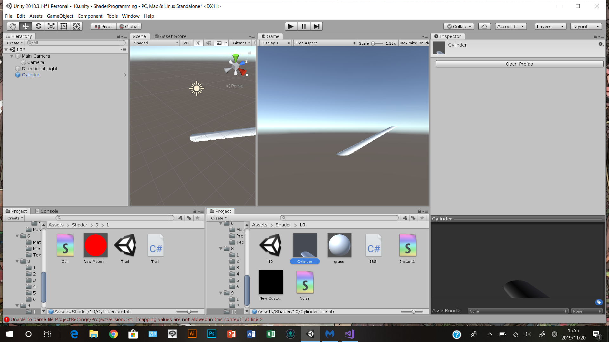
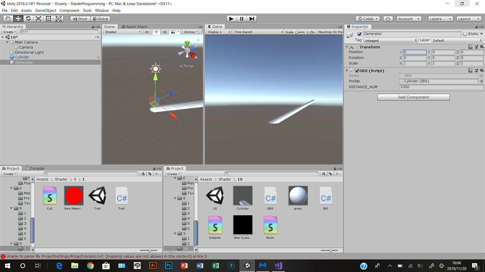
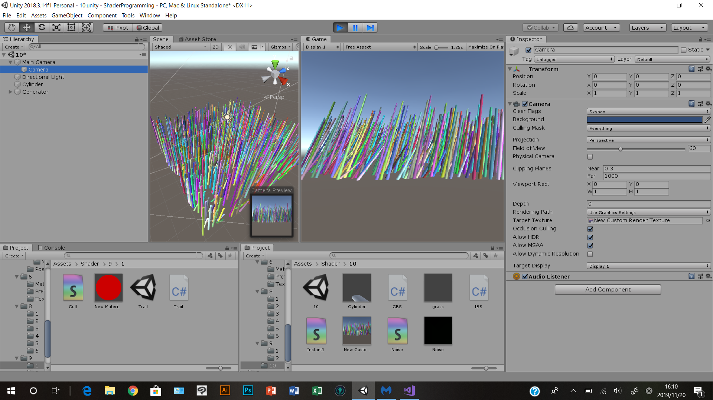
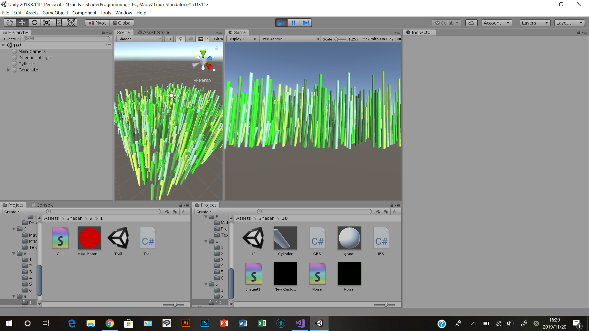
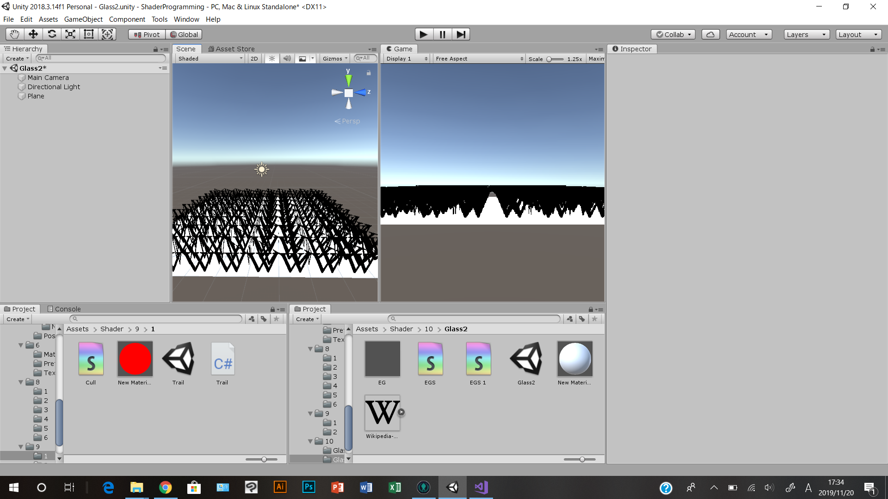
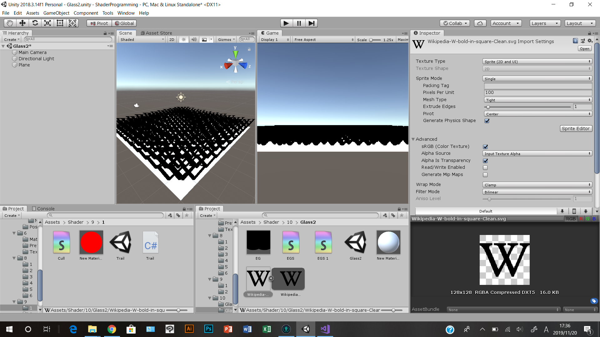
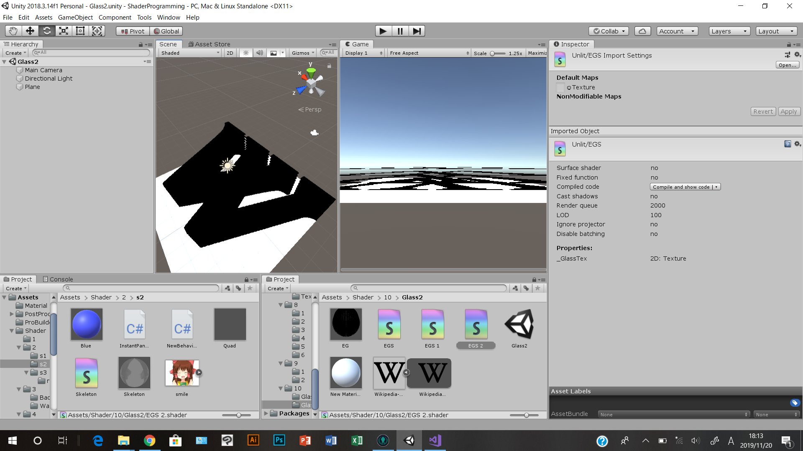
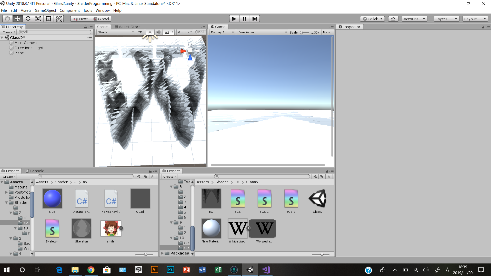

# インスタンシングとジオメトリシェーダ

# 経過画像
## インスタンシング
草プレハブを作ろう 
 

インスタンシングを使って表示しよう 
 

草を動かしてみよう 
 

リアルな草にしてみよう 
 

## ジオメトリシェーダ
ジオメトリシェーダを使って草を生やしてみよう 
 

草をビルボードにしてみよう 
 

シェル法に挑戦してみよう 
 

オレオレ草を作ろう 
 

# 資料

[本日の資料](https://github.com/t-kougei-game-pgws4-2019/lesson10/blob/master/2019_%E3%83%97%E3%83%AD%E3%82%B0%E3%83%A9%E3%83%A0%E3%83%AF%E3%83%BC%E3%82%AF%E3%82%B7%E3%83%A7%E3%83%83%E3%83%97IV%20(10)%20%E3%82%A4%E3%83%B3%E3%82%B9%E3%82%BF%E3%83%B3%E3%82%B7%E3%83%B3%E3%82%B0%E3%83%BB%E3%82%B8%E3%82%AA%E3%83%A1%E3%83%88%E3%83%AA%E3%82%B7%E3%82%A7%E3%83%BC%E3%83%80.pdf)

# 補足
授業で作成したプロジェクトファイルをforkしたプロジェクトに上げてください。

1_instancing, 2_geometry_shaderフォルダにプロジェクトのファイルを入れてください。
.gitignore を反映させて、無駄なファイルをアップロードしないようにしてください。

工程に応じて、result+.pngファイルを置いてください(表示されることを確認すること)。

データの著作権に気を付けてください。

翌日以降の提出の際はプルリクを投げてください。
